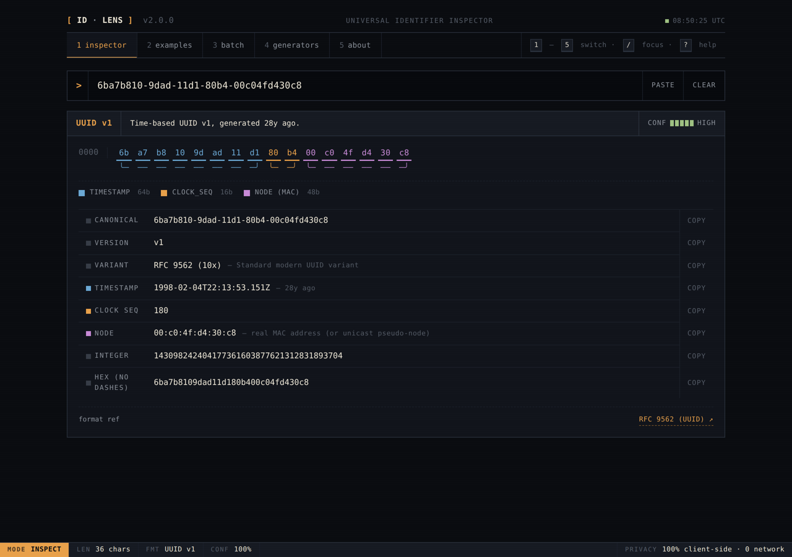
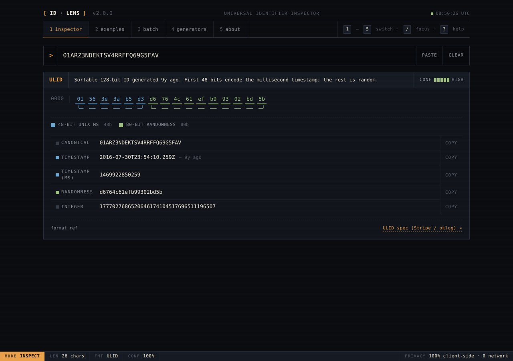
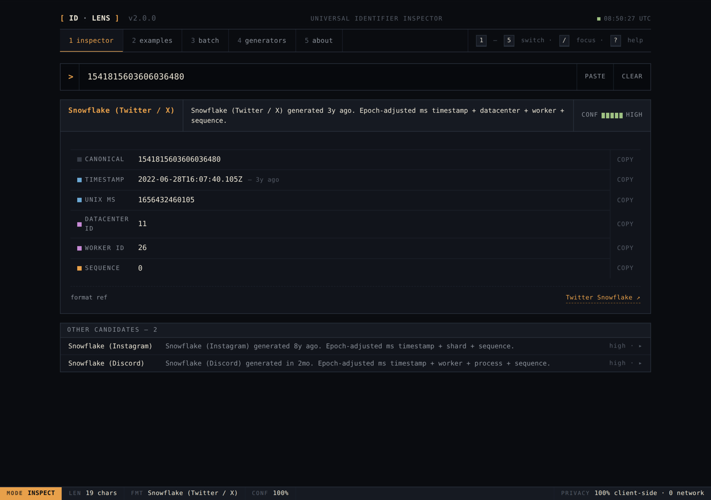
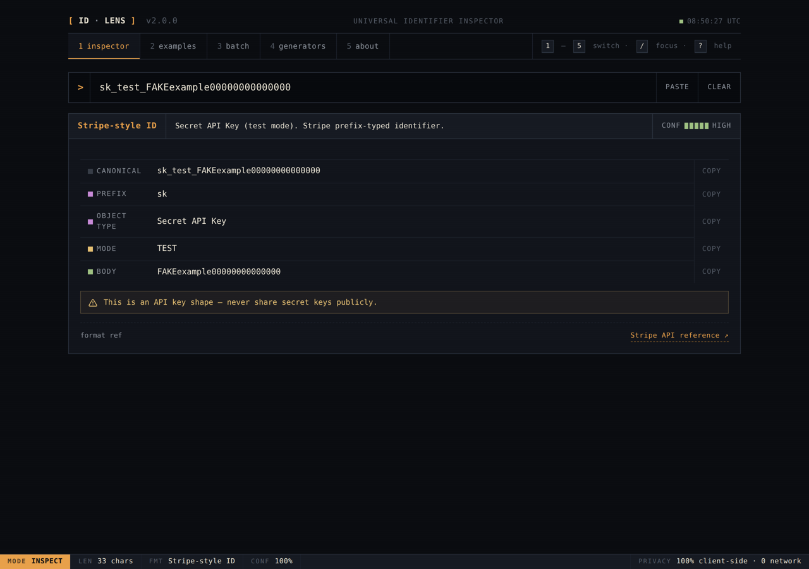
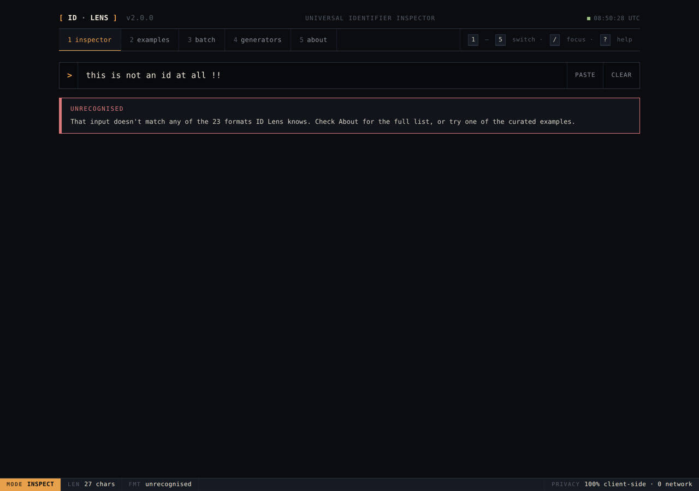
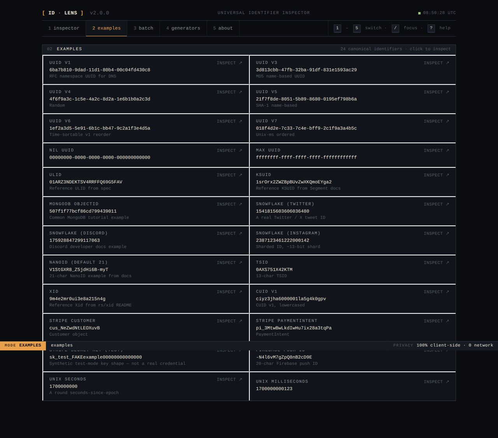
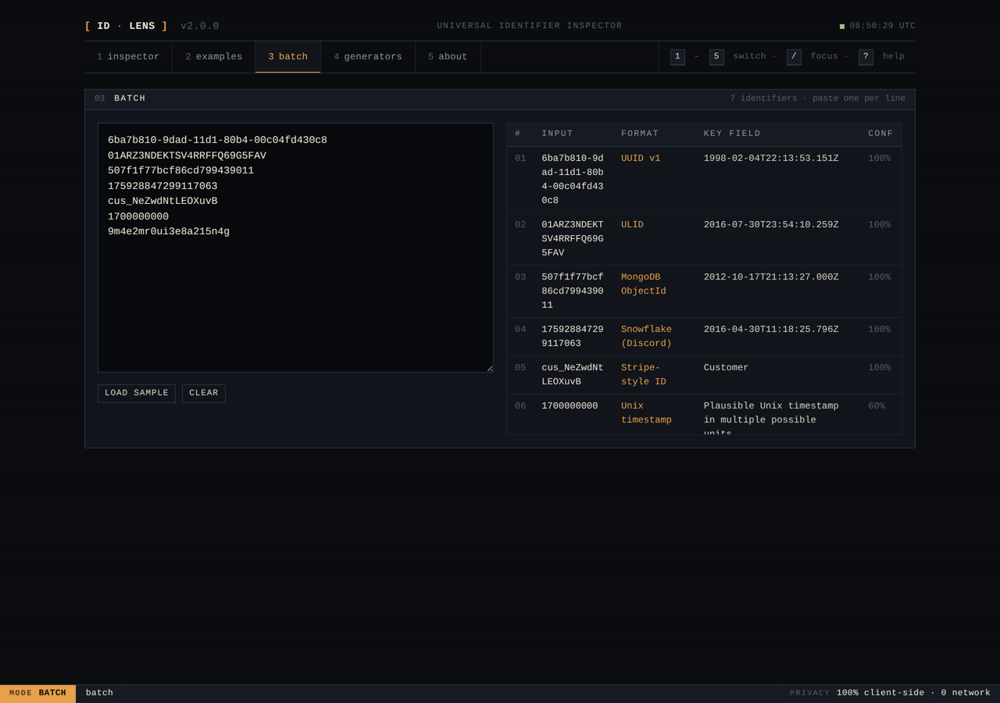
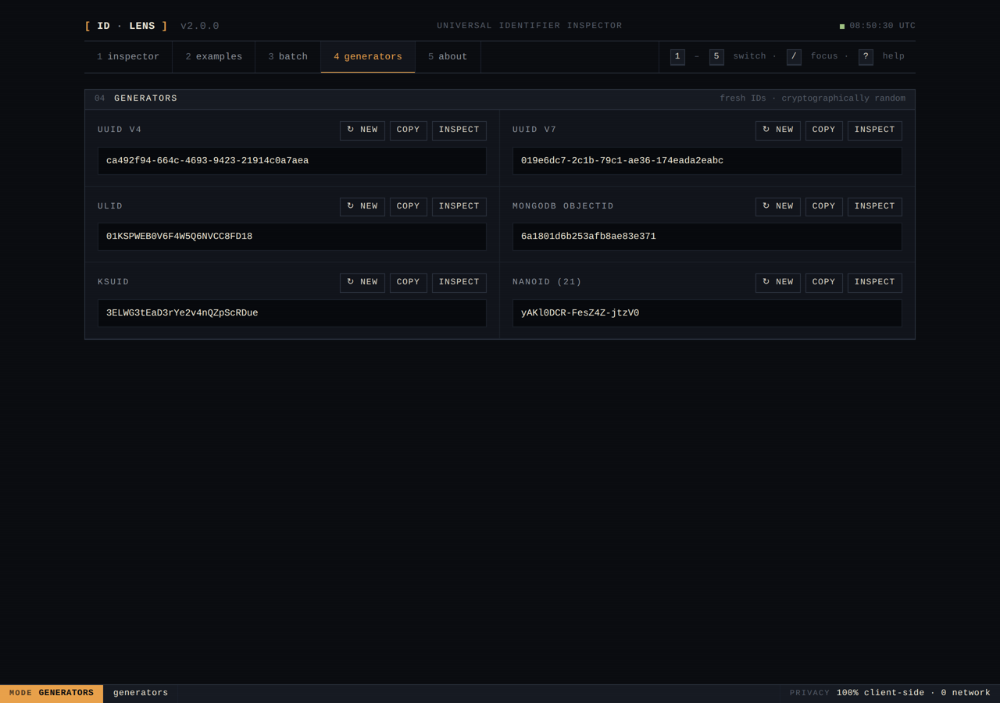
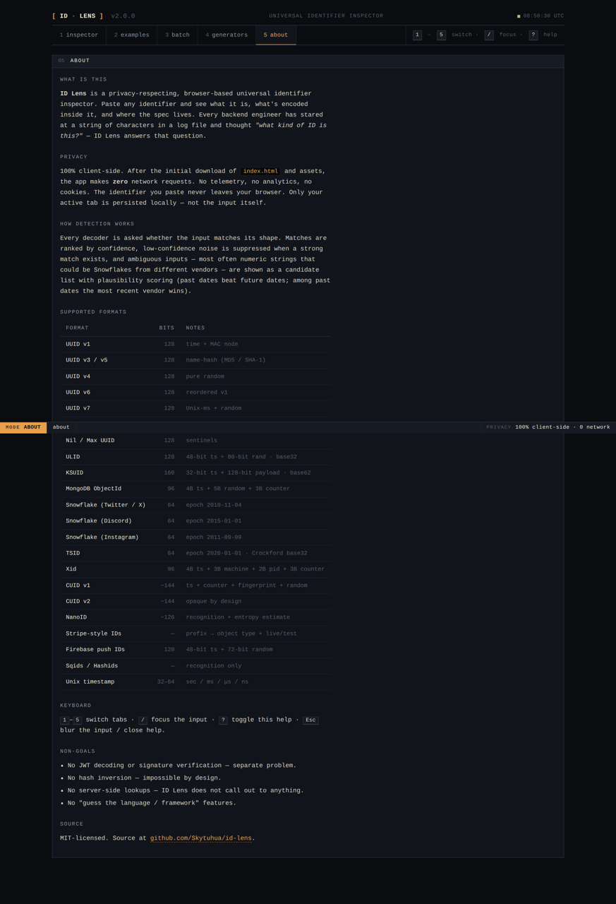
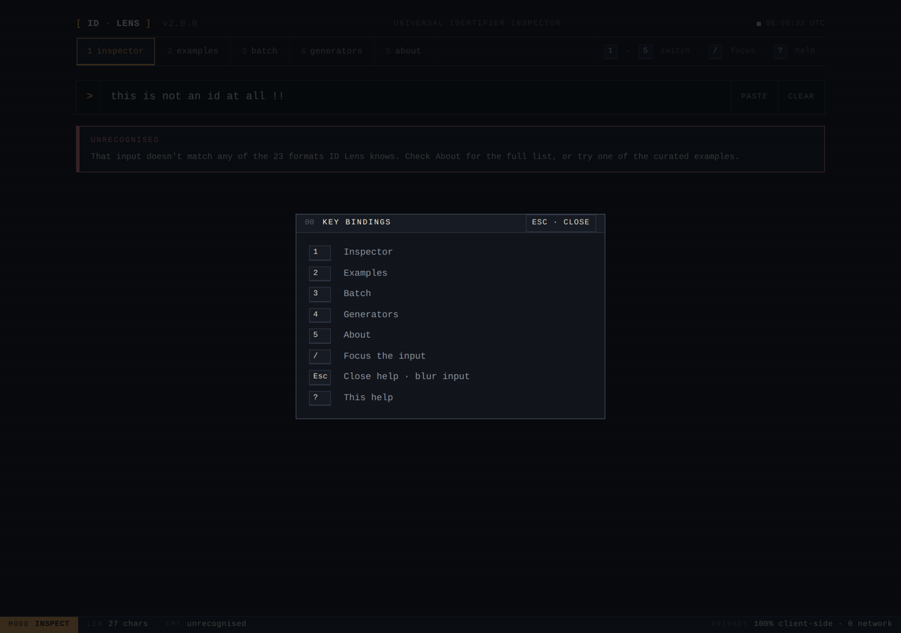

# ID Lens

> **Paste any identifier. See what it is.**
>
> A privacy-respecting, terminal-native universal identifier inspector in the
> browser. Auto-detects and decodes UUIDs, ULIDs, KSUIDs, Snowflakes
> (Twitter / Discord / Instagram), MongoDB ObjectIds, Stripe IDs, Firebase
> push IDs, TSIDs, Xids, CUIDs, Sqids, and Unix timestamps — all in one
> single-page app, 100% client-side, no telemetry.



## Why ID Lens

Every backend engineer, support engineer, and data analyst has stared at a
string of characters in a log file and thought *"what kind of ID is this?"*
There are great CLI tools for this ([`uuinfo`](https://github.com/Racum/uuinfo),
[`idinfo`](https://github.com/zcyc/idinfo)), but the browser options are
narrow — most decode only one format. ID Lens fills that gap with a single
page where you paste *anything* and immediately see what it is, the bytes
broken down by segment, the decoded fields, and a link to the canonical
spec.

The UI is deliberately terminal-native — sharp rectangles, fixed-grid
monospace, single amber accent, status bar pinned to the bottom — because
that's the workflow this tool lives in.

## Supported formats

| Format | Recognised? | Decoded fields |
|---|---|---|
| **UUID v1** | ✅ | timestamp, clock_seq, node (MAC), version, variant |
| **UUID v3 / v5** | ✅ | algorithm (MD5 / SHA-1), version, variant |
| **UUID v4** | ✅ | version, variant |
| **UUID v6** | ✅ | reordered v1 timestamp, clock_seq, node |
| **UUID v7** | ✅ | Unix-ms timestamp, rand_a, rand_b |
| **UUID v8** | ✅ | custom (vendor-defined) payload |
| **Nil & Max UUID** | ✅ | sentinel labels |
| **ULID** | ✅ | 48-bit Unix-ms timestamp + 80-bit randomness |
| **KSUID** | ✅ | 32-bit timestamp (epoch 2014-05-13) + 128-bit payload |
| **MongoDB ObjectId** | ✅ | 4-byte timestamp + 5-byte process random + 3-byte counter |
| **Snowflake (Twitter / X)** | ✅ | epoch-shifted ms timestamp + datacenter + worker + sequence |
| **Snowflake (Discord)** | ✅ | epoch-shifted ms timestamp + worker + process + increment |
| **Snowflake (Instagram)** | ✅ | epoch-shifted ms timestamp + shard + sequence |
| **NanoID (default 21)** | ✅ | length, alphabet, entropy estimate |
| **TSID** | ✅ | 42-bit ms timestamp (epoch 2020-01-01) + 22-bit random |
| **Xid** | ✅ | timestamp + machine + PID + counter |
| **CUID v1** | ✅ | timestamp + counter + host fingerprint + random |
| **CUID v2** | ✅ | recognised; v2 is opaque by design |
| **Stripe-style IDs** | ✅ | prefix → object type, live / test mode, key warnings |
| **Firebase push IDs** | ✅ | 48-bit Unix-ms timestamp + 72-bit random |
| **Sqids / Hashids** | ✅ | recognised only — decoding needs the issuer's alphabet & salt |
| **Unix timestamp** | ✅ | seconds, milliseconds, microseconds, nanoseconds |

When more than one format plausibly matches, ID Lens shows every candidate
ranked by confidence rather than guessing — see the Snowflake disambiguation
example below.

## Privacy

- **100% client-side.** After the initial download of HTML/CSS/JS, the
  app makes **no network requests**.
- **No telemetry**, no analytics, no cookies. The identifier you paste
  never leaves your browser.
- **No local storage of inputs** — only the active tab is persisted.
- Strict Content Security Policy (`default-src 'self'`, `connect-src 'self'`,
  `frame-ancestors 'none'`).

The status bar at the bottom of every view shows
`PRIVACY 100% client-side · 0 network` as a permanent reminder of the
product's whole reason for being.

## Try it

- Open the deployed app: [`https://skytuhua.github.io/id-lens`](https://skytuhua.github.io/id-lens)
- Or download `id-lens-vX.Y.Z-dist.zip` from the [releases page](https://github.com/Skytuhua/id-lens/releases)
  and open `index.html` directly in any modern browser — it works from a
  `file://` URL with no server needed.

## Quick examples

| Paste this | Get this |
|---|---|
| `6ba7b810-9dad-11d1-80b4-00c04fd430c8` | UUID v1, 1998-02-04, MAC `00:c0:4f:d4:30:c8` |
| `01ARZ3NDEKTSV4RRFFQ69G5FAV` | ULID, 2016-07-30 |
| `507f1f77bcf86cd799439011` | MongoDB ObjectId, 2012-10-17 |
| `175928847299117063` | Snowflake (Discord), 2016-04-30 |
| `1541815603606036480` | Ambiguous — primary Twitter (2022) + Discord/Instagram alternates |
| `cus_NeZwdNtLEOXuvB` | Stripe Customer object |
| `sk_test_FAKEexample00000000000000` | Stripe **test-mode** Secret API Key (synthetic) |
| `9m4e2mr0ui3e8a215n4g` | Xid |
| `1700000000` | Unix seconds: 2023-11-14 |

## Tabs

- **Inspector** — paste an ID, see the breakdown with a hex-dump
  cross-section (leader-line brackets under each contiguous segment),
  field grid, copy buttons, and a spec link.
- **Examples** — one-click load of a curated identifier for every format.
- **Batch** — paste many identifiers, one per line, see them tabulated
  with format / key-field / confidence.
- **Generators** — fresh UUID v4 / v7, ULID, KSUID, ObjectId, NanoID.
  Use `crypto.getRandomValues` for cryptographic-quality randomness.
- **About** — privacy stance, supported formats, key bindings.

## Keyboard shortcuts

| Key       | Action                  |
|-----------|-------------------------|
| `1`–`5`   | switch tabs             |
| `/`       | focus the Inspector input |
| `?`       | toggle the help overlay |
| `Esc`     | close help · blur input |

## Run locally

```sh
git clone https://github.com/Skytuhua/id-lens.git
cd id-lens
npm install
npm run dev       # http://localhost:5173
```

Other scripts:

| Command            | What it does                                       |
|--------------------|----------------------------------------------------|
| `npm run build`    | Type-check + production build into `dist/`        |
| `npm run preview`  | Serve the production build at `http://localhost:4173` |
| `npm test`         | Run the full Vitest unit-test suite               |
| `npm run lint`     | ESLint over `src/` and `tests/`                   |
| `npm run format`   | Prettier write                                    |

Building produces a static `dist/` directory you can deploy to any host
(GitHub Pages, Netlify, Vercel, S3, …) or open directly via `file://`.

## Architecture

- **Stack:** Vite + TypeScript + Preact (~3 KB runtime). System mono with
  `JetBrains Mono` as a soft preference; no web fonts are downloaded.
- **Decoders** live in `src/decoders/*.ts`, one file per format. Each
  exports a `Decoder` with a `matches(input)` probe and a `decode(input)`
  function returning a structured `DecodeResult` (format, confidence,
  fields, optional byte layout, warnings, reference).
- **Detection** (`src/decoders/index.ts`) runs every decoder's `matches`,
  collects candidates, sorts by confidence, suppresses low-confidence
  noise when a high-confidence match exists, and expands Snowflake into
  all plausible vendor variants ranked by date plausibility (past dates
  beat future dates, more recent vendor beats older among past dates).
- **UI** is a small set of Preact components in `src/components/`:
  `Titlebar`, `TabBar`, `StatusBar`, `Panel`, `Inspector`, `ResultCard`,
  `ByteLayout` (the hex-dump cross-section), `FieldRow`, `Candidates`,
  `Examples`, `Batch`, `Generators`, `About`, `HelpOverlay`.

Detailed notes live in [`ARCHITECTURE.md`](./ARCHITECTURE.md),
[`SPEC.md`](./SPEC.md), [`DESIGN.md`](./DESIGN.md),
[`RESEARCH.md`](./RESEARCH.md), [`REVIEW.md`](./REVIEW.md), and the
running [`BUILD_LOG.md`](./BUILD_LOG.md).

## Screenshots

| | |
|---|---|
|  |  |
|  |  |
|  |  |
|  |  |
|  |  |

Mobile (390 px) screenshots live alongside in `review/screenshots/mobile-*.png`.

## Limitations / non-goals

- **No JWT decoding or signature verification.** JWTs are a separate
  problem with their own (excellent) tools.
- **No hash inversion.** Impossible by design.
- **No server-side lookups.** ID Lens does not call out to anything.
- **Sqids / Hashids decoding** requires the issuer's alphabet + salt; ID
  Lens recognises the shape but cannot recover the underlying integers.
- **Snowflake disambiguation is best-effort.** A numeric string can
  plausibly decode under multiple vendor epochs; ID Lens shows all of
  them ranked by recency-of-past-date.
- **No light theme** in v2 — the redesign commits to dark-only.

## Contributing

Issues and PRs welcome. Run `npm test && npm run lint && npm run build`
before opening a PR.

## License

[MIT](./LICENSE) © 2026 Skytuhua
